# Introduction
Head pose prediction has various applications such as driver monitoring and attention recognition. For example, the head pose of a driver can be used for identifying whether a driver is distracted, such as looking at the phone or falling asleep.

This task aims at building an end-to-end **CNN** convolutional neural network to identify the head pose given an image of a person in terms of both **Tilt** (Vertical angle) and **Pan** (Horizontal angle). Transfer learning with **Resnet 50** is implemented in this task.
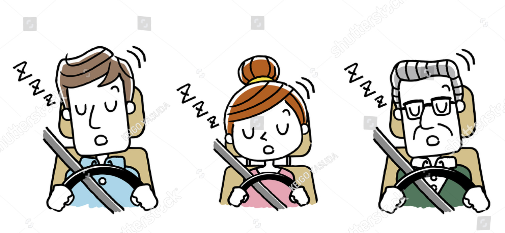

# Overview of dataset
## Training set & Testing set
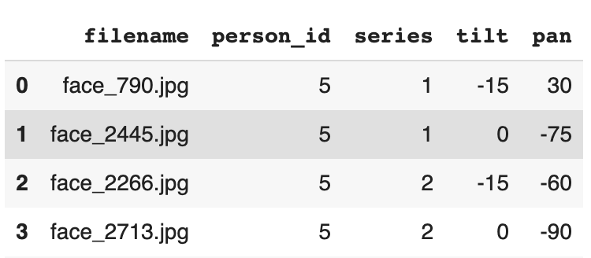 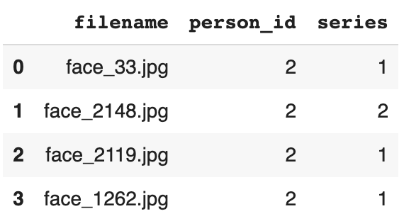. 

   
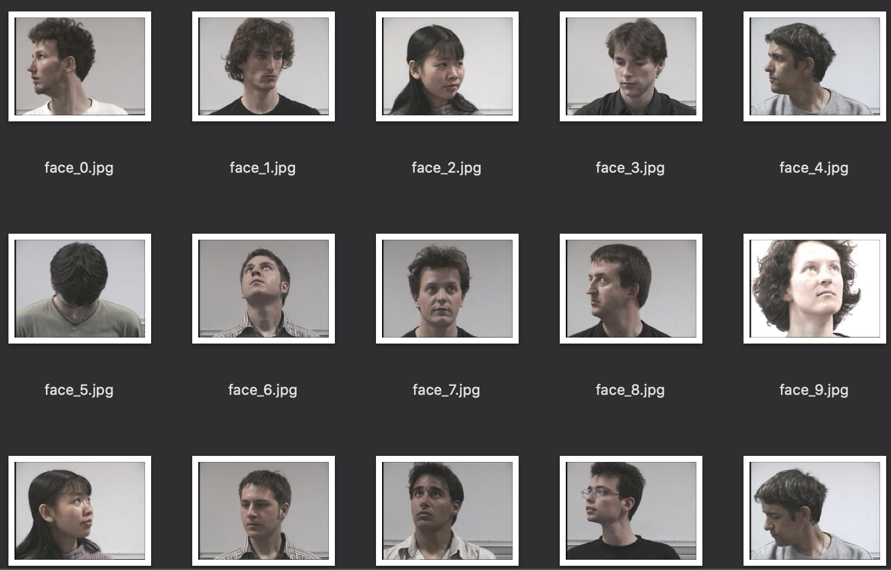

# Exploring the data
## Training set distribution
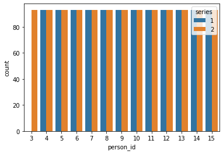. 
  
we can see that data is evenly distributed between series 1 and series 2, and for each person, the data is evenly distributed between the 2 series, except for person_3, 0 in series 1.
## Split training set into training set & validation set
In order to make the model generalize better, validation set contains people it has never seen and people it has seen before but in a different series. Therefore, [person_3_series2, person_5_series1, person_5_series2, person_4_series1, person_6_series2] are picked for the validation set. The reason why person_4_series1, person_6_series2 are picked is that, with person_4_series1, the model can predict on a person of series1 whom it has seen but in a different series, and similarly for series 2 with person_6_series2.
### After split:

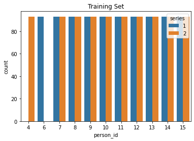 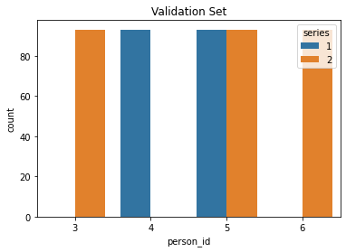
        

# Decision before training the model
## Why Convolutional neural network
In CNN, with convolutional layers, parameters can be shared. For example, a good learnt parameter set in a line-detecting filter can be shared with other parts of the image to detect line. Meanwhile, with sparse connectivity, feature extraction usually happens locally, instead of across the whole image.
## Picking the activation function
The 3 main types of non-linear activation functions are Sigmoid, Tanh and Relu. However, both sigmoid and tanh lead to saturation, making the values only sensitive around 0. Besides, Relu is simpler to compute, which makes a significant difference in training time. Therefore, Relu is picked as the activation function.
## Picking the loss function
There're 3 common loss functions for regression task, which are MSE (Mean Absolute Error), MAE (Mean Square Error) and RMSE (Root Mean Squared Error). MAE measures the the average of absolute difference between the predicted values and the target values, but it doesn't punish the larger error during the training process. As to MSE, it squared the average of distance, so it's good at punishing the large errors. RMSE is the square root of the averaged distance between the predicted value and the target value, and it fails to punish large errors.[1] Due to the fact that one of the common applications of head pose estimation is driver monitoring, large errors should be avoided at all cost, MSE is picked as the loss function.
## Setting the loss weights
There are 2 outputs in this task, which are tilt and pan. As mentioned above, self-driving is a major application of this task. The same error with pan is more inclined to car accident than the same error with tilt, therefore pan should be emphasized more than tilt. For that reason, loss weights [0.7,1.3] are assigned to tilt and pan respectively.
## Picking the evaluation metric
Similar to loss function, the 3 common evaluation metrics are MSE, MAE and RMSE. I picked MAE as it's more intuitive for me to interpret the performance of a model.
## Learning rate scheduler
Gradually reducing the learning rate is beneficial to training the model as a large learning rate at the beginning speeds up the learning process and a gradually reduced learning rate prevents oscillation.
## Batch normalisation
In deep learning, training a neural network with a big number of hidden layers can be challenging, and one of the reason is that the input of each hidden layer is sensitive to weights initialised in the
first layer. With batch normalisation, input of each layer is normalised and less sensitive to weight initialisation, which makes the training process more stable and easier.[2]
## Regularisation techniques
In the training process, in order to prevent overfitting, some regularisation techniques are applied, such as L2, Dropout and early stopping.
- **Early stopping**
A technique to avoid overfitting by stopping the training process when the validation loss doesn't get better, which also helps save time.
- **Dropout**
One of the most effective regularisation technique, it drops some connections among perceptrons so that the neural network can avoid depending on some particular perceptrons.
- **L2**
A regularisation technique to impose penalties on weights.
## Data augmentation
Given that the size of the dataset is quite small, data augmentation is implemented to simulate generating more data. Because this task predicts angle of head posture, rotation is avoided. Besides, after applying vertical shifting, the images are somehow vertically distorted, so only horizontal shift and brightness shift are applied.
## Picking the baseline model
Training with a deep neural network increases the model capacity but it also comes with side effects, such as gradient descent and gradient explosion, which makes it difficult to train a neural network. This problem can be solved with residual blocks in Resnet. Therefore, Resnet50 is used as the base model for transfer learning.

# Training the model
## Overview of my training
The basic architecture is Resnet50 and 4 fully connected layers at the end. The output layer of Resnet is removed as this task has a different number of outputs. In general, I started experimenting with transfer learning with the whole Resnet, then tuned it based on its performance and whether there is overfitting, mostly through regularisation techniques and changing the number of layers in Resent50 trainable.
## Why making some layers trainable
As Resnet50 is used for image classification, and this task is a regression task, so it's better to make a portion of the model trainable so that the trainable layers can learn based on this specific task. The non-trainable portion acts as feature extractor, which can be used by the trainable layers.

## Training process
In the first model, trans_Model_A, there's overfitting and fluctuation in the validation learning curve. Therefor, in Trans_Model_B, L2 regularisation is used for overfitting. For the fluctuation, momentum rate in batch normalisation is decreased from 0.99 to 0.9, which makes the batch normalisation process (in the fully connected layers) pays more attention to the previous parameters. However, L2 slightly decreased the training MAE but didn't help the model generalise better, with the validation MAE stays the same. The fluctuation continued despite a lower momentum rate in batch normalisation.

In Trainable_model, trans_Model_A was the base model, but with the last 20 layers in Resnet50 trainable. The training MAE stayed the same but validation MAE dropped slightly, so the number of trainable layers was increased to 45 in the following model, Trainable_model_A. However, it didn't improve the performance, and it caused some spikes in the validation learning curve. Thus, only 10 trainable layers in following model, Trainable_model_B.

In Trainable_model_B, even though the performance didn't improve and overfitting still exists, the fluctuation was smoothed out. Therefore, we made Trainable_model_B the baseline model and try dropout for overfitting.

In Trainable_DO, dropout (0.25) is imposed on all fully connected layers but the output layer. The training MAE increased due to dropout, but the validation MAE stays roughly the same and a bit more volatile.

## Comparing the 2 best models (Trainable_model_B vs Trainable_DO)
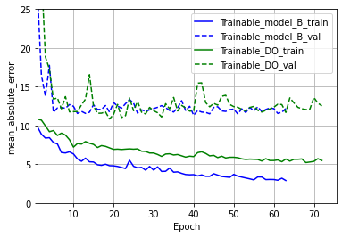. 
  
Looking at the learning curves, the 2 models have similar performance. However, the validation
MAE of Trainable_DO is more volatile.
### Avoiding 'False Negative'
Due to fact that one of the important applications of this task is driver monitoring, we should avoid a model that predicts a true wide angle as a narrow angle. The definition of a wide angle here is that |angle|(absolute value of angle), the larger, the wider. It's similar to the **false negative**. We want to avoid a situation where the driver is looking away, but the model predict him/her to be looking ahead in the center. 🚨
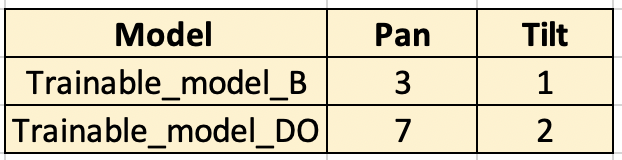. 
 
Amongst the 10 worst predictions for each model. Trainable_model_B is a better model at this point as it has 3 and 1 downward predictions in 'pan' and 'tilt' respectively, while Trainable_DO has 7 and 2 downward predictions in 'pan' and 'tilt' respectively.
### Error distribution
We also looked at the the error distribution of the 2 models through violinplots. For both 'pan' and 'tilt' prediction of both models, the error distribution is quite similar to each other. Regardless of 'pan' or 'tilt' the prediction is more accurate on wide angles (close to -90 or 90). In general and interestingly, 'pan' prediction is better than 'tilt' prediction, and this is probably due to the loss weights [0.7,1.3] assigned to the 2 outputs in the training process.
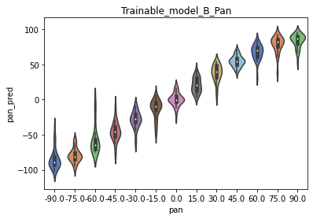 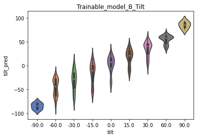
       
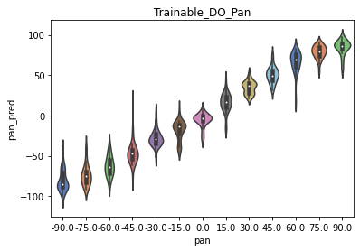 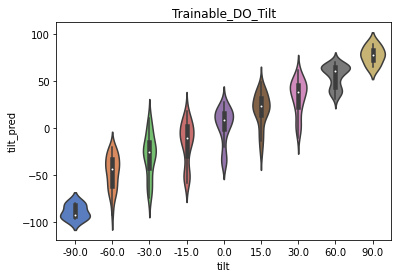
       

### Final decision
Combining the learning curves, wide-to-narrow angle prediction numbers and the prediction error distribution, I would like to pick **Trainable_model_B** as the final model.
#### Trainable_model_B Architecture
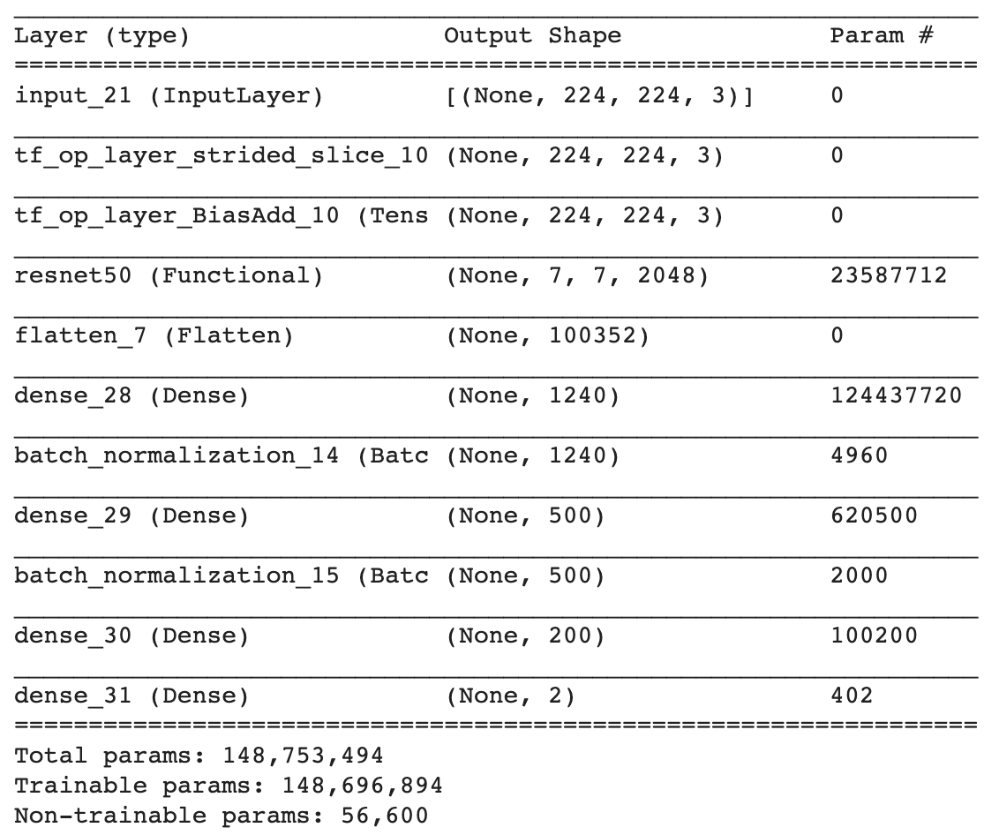
               
  

# Output investigation
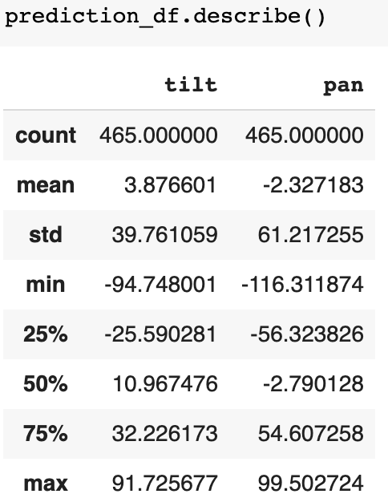
In the outputs with the final model, for 'pan' prediction, the min is -110 and the max is 95, which doesn't reflect the real life situation [-90,90]. It can be fixed by setting a boundary in the outputs if possible.
         

# Independent evaluation
Results on independent testing set:
- MAE for tilt:  14.6
- MAE for pan:  13.2

#### PS
This [notebook](https://github.com/ChenLangChen/Head-Pose-Prediction/blob/master/HeadPosePrediction.ipynb) was originally written in GoogleColab, which provides an easy way for content orientation through Table of Contents.

# References
[1]Kaggle.com. 2020. Housing Prices Competition For Kaggle Learn Users. [online] Available at: <https://www.kaggle.com/c/home-data-for-ml-course/discussion/143364> [Accessed 7 September 2020].
[2]Brownlee, J., 2020. A Gentle Introduction To Batch Normalization For Deep Neural Networks. [online] Machine Learning Mastery. Available at: <https://machinelearningmastery.com/batch- normalization-for-training-of-deep-neural-networks/> [Accessed 7 September 2020].
